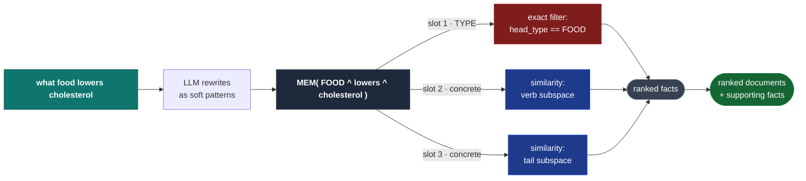
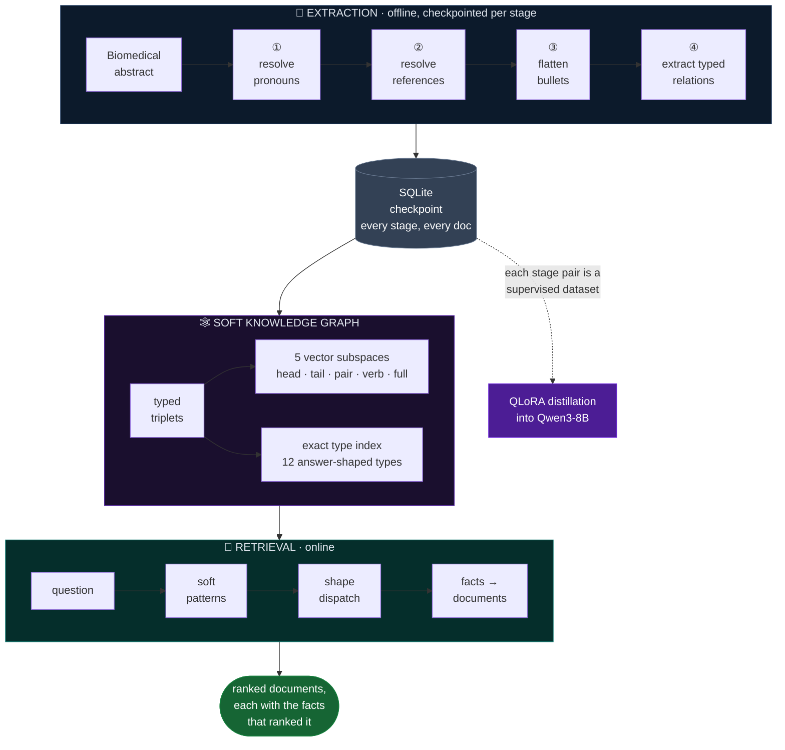
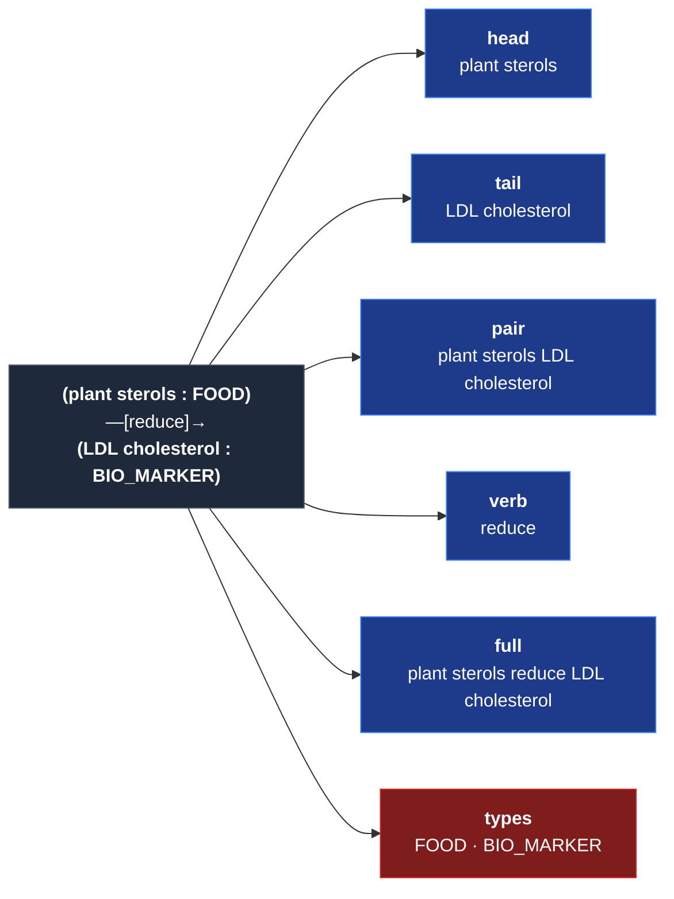
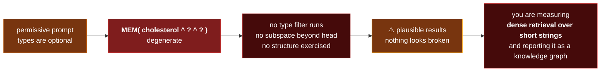

<div align="center">

# Soft Knowledge Graphs for Biomedical Retrieval

**Index documents as typed facts. Query them with partially-specified graph patterns,
resolved by vector similarity instead of exact matching.**

*Hard structure where structure is reliable. Soft matching everywhere else.*

<br/>

[](https://www.python.org/)
[](https://pytorch.org/)
[](https://huggingface.co/jinaai/jina-embeddings-v3)
[](https://huggingface.co/Qwen)
[](https://github.com/beir-cellar/beir)
[](LICENSE)

[**Method**](docs/METHOD.md) · [**Design notes**](docs/DESIGN_NOTES.md) ·
[**Evaluation**](evaluation/README.md) · [**Fine-tuning**](finetuning/README.md)

</div>

---

## Why

Retrieval over clinical literature fails in a characteristic way. The evidence that answers
*"what foods lower LDL cholesterol"* is usually **one relation between typed entities** — buried in an
abstract that is mostly about study design.

<table>
<tr><th align="left" width="26%">Approach</th><th align="left">What it does</th><th align="left" width="34%">How it fails</th></tr>
<tr>
<td><b>Dense</b><br/><sub>whole-document</sub></td>
<td>Embeds the document as one vector</td>
<td>The answering sentence is averaged together with 300 words of methodology. Finds documents <i>about</i> a topic, not documents <i>containing</i> a fact.</td>
</tr>
<tr>
<td><b>Lexical</b><br/><sub>BM25</sub></td>
<td>Matches surface forms</td>
<td><code>heart attack</code> ≠ <code>myocardial infarction</code> ≠ <code>MI</code>. Every synonym pair is a miss, and biomedical text is full of them.</td>
</tr>
<tr>
<td><b>Strict KG</b><br/><sub>generated Cypher</sub></td>
<td>Exact-matches an extracted graph</td>
<td>Inherits the extractor's vocabulary. A miss returns the <b>empty set</b> — no signal about how close it came.</td>
</tr>
<tr>
<td><b>This work</b><br/><sub>soft patterns</sub></td>
<td>Typed facts + partially-specified patterns</td>
<td>Single-hop only, and bounded by extraction coverage. Both measured, not assumed.</td>
</tr>
</table>

The structural fix is to index **facts**, not documents. The reason KG-RAG usually doesn't deliver on
that is brittleness — so the question is where to put the softness.

---

## The core idea

> **The *type* of an entity is a closed-vocabulary decision an extractor makes reliably. Keep it exact.
> The *surface form* is open-vocabulary and nobody is consistent about it. Make it soft.**

A query is a triplet in which each slot is independently one of three kinds:

<div align="center">

| | Slot kind | Written as | Resolved by |
|:--:|:--|:--|:--|
| 🟦 | **Concrete** | `cholesterol` | vector similarity, in the relevant subspace |
| 🟥 | **Type** | `FOOD` · `DISEASE_DISORDER` | **exact** match on the node's assigned type |
| ⬜ | **Wildcard** | `?` | unconstrained |

</div>



**Nothing in a pattern has to match a stored string.** `MEM( FOOD ^ lowers ^ cholesterol )` reads as
*"a fact whose head is typed FOOD, whose tail is near 'cholesterol', whose relation is near 'lowers'"* —
and it works whether the graph recorded `serum LDL`, `blood cholesterol`, or `hypercholesterolaemia`.

Retrieval degrades **continuously** rather than falling off a cliff: a slot matching nothing exactly
still ranks the nearest candidates.

<details>
<summary><b>Why twelve coarse types instead of linking to UMLS</b></summary>

<br/>

The schema is not an attempt at a biomedical ontology, and it would be a poor one. It is a set of
**answer categories** — each type names something a clinician might ask *about*:

| | | | |
|:--|:--|:--|:--|
| `ACTIVITY` | `BODY_PART` | `CHEMICALS` | `DISCRIMINATIVES` |
| `DISEASE_DISORDER` | `DRUGS` | `BIO_MARKER` | `FOOD` |
| `GENES` | `HEALTH_PROCEDURES` | `SIGN_OR_SYMPTOM` | `RISK_FACTOR` |

That property is what makes a type usable as a **query-side wildcard**. *"What disease causes X"* maps
to `DISEASE_DISORDER`; *"what food helps X"* maps to `FOOD`. A query rewriter must be able to guess the
right type from the question — which puts a hard ceiling on how fine the schema can be.

A million-concept ontology gives precision but **no usable abstraction to query with**: there is no way
to write *"any concept that could answer this question"* over a vocabulary that large. Synonymy is
handled by the embedding space instead of by a canonicalisation step that has to be right in advance.

The cost is real and worth stating: `BIO_MARKER` absorbs a wide range of outcome measures, and a finer
schema would discriminate better. See [DESIGN_NOTES](docs/DESIGN_NOTES.md).

</details>

---

## Architecture



The retrieval unit is a **fact**, so every ranked document arrives with the specific extracted
statements that caused it to rank. That is a property of the mechanism, not an explanation layer bolted
on afterwards.

### Five subspaces, not one

Each triplet is embedded five times, because **a pattern constrains different parts of a triplet
depending on its shape**, so the right comparison target changes with it.



*"What FOOD lowers cholesterol"* should match on the **tail** while filtering heads by type — scoring
it against a whole-fact embedding drags the verb and the other endpoint in as noise. A fully specified
pattern is the opposite: its slots are only *jointly* meaningful, so the whole fact is the right unit.

> One undifferentiated index forces every query shape through the same comparison, and discards the
> structure extraction just paid for.

<details>
<summary><b>The full shape → strategy dispatch table</b></summary>

<br/>

Shapes are written head-first as three characters — `c` concrete, `T` type, `?` wildcard — which makes
it easy to audit what a query-rewriting prompt actually produces.

| Shape | Eligible rows | Scored against |
|:--|:--|:--|
| `ccT` `Tcc` | type index on the typed endpoint | opposite endpoint, + `full` on the concrete half |
| `c?T` `T?c` | type index | opposite endpoint subspace |
| `Tc?` `?cT` | type index | `verb` |
| `T?T` `TcT` | **intersection** of both type indices | `verb` if given, else `full` vs the question |
| `ccc` | all | `full` |
| `c?c` | all | `head` ∩ `tail`, unioned with `pair` |
| `cc?` `?cc` | all | endpoint subspace, + `full` on the given half |
| `c??` `??c` | all | single endpoint subspace &nbsp;⚠️ *degenerate* |
| `?c?` | all | `verb` |

Two scoring notes. Multiple similarity components are averaged over the components **present** for each
candidate, not over all possible ones — a fact should not be penalised for missing a channel it was
never eligible for, since that measures the funnel rather than relevance. And a verb constraint
**rescores** an already-selected candidate set rather than re-filtering it, which is how a relation
narrows a set chosen by its endpoints without being able to eliminate it.

Implemented in [`softkg/retrieve.py`](softkg/retrieve.py).

</details>

---

## Quickstart

```bash
git clone https://github.com/MohammadAsadolahi/soft-medical-kg-rag.git
cd soft-medical-kg-rag
pip install -r requirements.txt
```

CPU is sufficient for everything except fine-tuning. The embedding cache means the graph build cost is
paid once.

<table>
<tr><td width="33%" valign="top">

**① Extract**

```bash
export SOFTKG_API_KEY=...
python scripts/run_extraction.py \
  --corpus data/corpus.jsonl \
  --db data/checkpoint.db
```

Resumable — interrupt freely. A crash costs at most one LLM call.

</td><td width="33%" valign="top">

**② Build**

```bash
python scripts/build_graph.py \
  --db data/checkpoint.db \
  --out data/graph
```

Embeds all five subspaces and persists them.

</td><td width="33%" valign="top">

**③ Search**

```bash
python scripts/search.py \
  --graph data/graph \
  -q "what foods lower cholesterol"
```

Returns documents *and* the facts that ranked them.

</td></tr>
</table>

### Real output

```
Soft patterns (4):
  [Tcc] MEM( FOOD ^ lowers ^ cholesterol )
  [ccT] MEM( cholesterol ^ lowered by ^ FOOD )
  [ccT] MEM( cholesterol ^ reduced by ^ ACTIVITY )
  [Tcc] MEM( DRUGS ^ lowers ^ cholesterol )

 1. MED-1249   score=0.3353
      [0.335] (soy protein meat analogues : FOOD) --[reduces]--> (plasma cholesterol : BIO_MARKER)
              via [Tcc] MEM( FOOD ^ lowers ^ cholesterol )
      [0.330] (plant protein diet : FOOD) --[reduces]--> (plasma cholesterol : BIO_MARKER)
              via [Tcc] MEM( FOOD ^ lowers ^ cholesterol )
 2. MED-1303   score=0.3313
      [0.331] (Avena sativa : FOOD) --[reduces]--> (cholesterol : CHEMICALS)
              via [Tcc] MEM( FOOD ^ lowers ^ cholesterol )
 3. MED-1319   score=0.3223
      [0.322] (rural Chinese diets : FOOD) --[are associated with]--> (low plasma cholesterol : BIO_MARKER)
              via [ccT] MEM( cholesterol ^ lowered by ^ FOOD )
```

> 💡 `Avena sativa` is **oats** — retrieved for a query that never mentions oats, via a pattern that
> never mentions them either. The type slot did the work: *any* `FOOD` in a lowering relation to
> something near `cholesterol`.

<details>
<summary><b>Driving the graph without an LLM, and as a library</b></summary>

<br/>

```bash
# hand-written patterns -- probe the graph directly, no API needed
python scripts/search.py --graph data/graph -q "..." \
    --pattern "MEM( FOOD ^ lowers ^ cholesterol )"

# raw question against the fact index -- this is exactly the no-LLM ablation
python scripts/search.py --graph data/graph -q "..." --no-patterns
```

```python
from softkg import Embedder, LLMClient, SoftRetriever, build_graph, triplets_from_checkpoint

triplets = triplets_from_checkpoint("data/checkpoint.db")
embedder = Embedder(cache_dir="data/emb_cache")
graph    = build_graph(triplets, embedder)

retriever = SoftRetriever(graph, embedder, llm=LLMClient(api_key=..., endpoint=...))
for hit in retriever.search("what foods lower cholesterol"):
    print(hit.explain())
```

</details>

---

## Extraction: decontextualization is the hard part

A triplet is indexed **alone**, torn out of its paragraph. Any fact whose meaning depends on
surrounding discourse becomes noise the instant it is extracted:

```diff
- Fish oil was tested in 240 adults. It reduced LDL by 12% in this cohort.
!   ↳ extracting directly yields  (it) --[reduced]--> (LDL)     ← unusable
+ Fish oil was tested in 240 adults. Fish oil reduced LDL by 12% in this cohort.
!   ↳ now yields  (fish oil : DRUGS) --[reduces]--> (LDL cholesterol : BIO_MARKER)
```

So the pipeline rewrites each passage so **every sentence stands alone** before extracting anything.
This is the single largest quality lever in the system.

| | Stage | Why it is separate |
|:--:|:--|:--|
| ① | **Pronoun resolution**<br/><sub>`it` → `fish oil`</sub> | Combining ① and ② measurably increased unrequested paraphrasing — the model shifted from *substituting* to *rewriting* |
| ② | **Indirect reference transfer**<br/><sub>`to achieve that` → `to achieve weight loss`</sub> | Handles demonstratives and discourse anaphora, which ① is explicitly told to leave alone |
| ③ | **Bullet flattening** | Retained as an explicit **no-op** — [why](docs/DESIGN_NOTES.md#stage-3-is-a-deliberate-no-op) |
| ④ | **Typed extraction** | Forced tool call: JSON is *grammar-constrained*, not parsed out of prose |

<details>
<summary><b>Three details that matter more than they look</b></summary>

<br/>

**Structured output is constrained, not parsed.** A tool schema is declared, `tool_choice` pins the
model to it, and the arguments it is *compelled* to produce are the payload — the function is never
implemented. Malformed JSON becomes impossible by construction rather than something to retry around.
Extracting tens of thousands of triplets by asking for JSON in a prompt and parsing the reply is a
categorically worse experience.

**Typing is fused with extraction.** The extractor still holds the sentence context that distinguishes
`cholesterol`-as-`CHEMICALS` (a substance in food) from `cholesterol`-as-`BIO_MARKER` (a measured serum
level). A downstream classifier sees only the bare string and has to guess.

**Collapsed rewrites are rejected in code.** Reasoning models asked to rewrite a passage occasionally
return a summary, a title, or an empty string — each silently destroying a document, with no error to
catch. Three defences: a response contract in the prompt, explicit no-change examples, and a length
check that rejects any reply under half its input.

The extraction prompt is ~135 lines because nearly every line suppresses one observed failure class —
study framing, policy statements, nutrition-inventory filler, tautological measurements, confounder
lists. It lives in [`softkg/prompts.py`](softkg/prompts.py) as **data**, separate from calling code, so
it can be diffed and versioned as the artifact it is.

</details>

### Checkpointing buys you a training corpus for free

Every stage output for every document is committed to SQLite as it happens. That is not just crash
safety — **each adjacent column pair is a complete supervised dataset**:

<div align="center">

| Stage | Input column | → | Target column |
|:--|:--|:--:|:--|
| ① pronouns | `original_text` | → | `step1_pronoun_resolved` |
| ② references | `step1_pronoun_resolved` | → | `step2_references_resolved` |
| ④ extraction | `step3_flattened` | → | `step4_triplets_json` |

</div>

The expensive frontier-model run **is** the distillation corpus. No annotation pass, no labelling
effort — just the payoff for checkpointing honestly.

---

## Fine-tuning: distilling into an open 8B model

[`finetuning/`](finetuning/) trains **Qwen3-8B** with QLoRA on dual T4s via DDP, so the pipeline can run
locally without sending clinical text to a third party.

Pronoun resolution is treated in most depth because it is a **near-copy task** — the target is the input
with a few spans substituted — and that **inverts three standard fine-tuning intuitions**:

<table>
<tr><th align="left">Setting</th><th align="left">Normally</th><th align="left">Here</th><th align="left">Why</th></tr>
<tr><td><b>LoRA dropout</b></td><td>0.05–0.1</td><td><b>0</b></td><td>Near-copy fidelity <i>is</i> the task; dropout degrades exactly that</td></tr>
<tr><td><b>NEFTune</b></td><td>helps robustness</td><td><b>off</b></td><td>Noised embeddings paraphrase spans meant to be copied verbatim</td></tr>
<tr><td><b>Learning rate</b></td><td>1e-4 – 2e-5</td><td><b>5e-6</b></td><td>Higher rates collapsed loss in &lt;1 epoch while quality got <i>worse</i></td></tr>
</table>

> ⚠️ **Token loss is nearly useless as a quality signal here.** It is dominated by the ~95% of tokens
> trivially copied, so it barely registers the ~5% carrying the whole task. Loss goes very low while the
> model still mutates text it was supposed to reproduce.

So evaluation happens at the level the task operates on: **span-level precision/recall/F1 over the
changes the model made**, exact-match rate, and a per-sample category —
`EXACT` · `EXACT (no-change)` · `PARTIAL (conservative)` · `PARTIAL (mixed)` · `OVER-EDITED` ·
`MISSED ALL` · `HALLUCINATION`. The categories are what make the failure mode legible: a model can sit
at high F1 and still be unusable, because F1 over *changed* spans says nothing about whether the
*unchanged* 95% survived — which is precisely what matters when the output feeds extraction.

---

## Evaluation

[`evaluation/`](evaluation/) is a BEIR-protocol harness. Its premise: **a retrieval number is only as
trustworthy as the controls around it.** Most of the code exists to remove one specific way of fooling
yourself.

<table>
<tr><th align="left" width="30%">Control</th><th align="left">What it prevents</th></tr>
<tr><td>🔬 <b>Same encoder for the dense baseline</b></td>
<td>Otherwise the comparison conflates retrieval <i>structure</i> with embedding <i>quality</i> — an apparent gain may be nothing but a better encoder</td></tr>
<tr><td>⚖️ <b>Dual frames</b><br/><sub>restricted · full</sub></td>
<td>Full-corpus scoring penalises the graph for documents it never received; subset-only scoring flatters it by deleting distractors. Indices are <b>rebuilt per frame</b></td></tr>
<tr><td>🎯 <b>Coverage oracle</b></td>
<td>Separates <i>“the retrieval is weak”</i> from <i>“the graph never saw the answer”</i> — same headline number, completely different fixes</td></tr>
<tr><td>🚫 <b>LLM ablation</b></td>
<td>Pattern generation removed, so the query-rewriting layer's contribution is <b>measured</b> rather than assumed</td></tr>
<tr><td>📊 <b>Paired bootstrap</b><br/><sub>+ win/loss/tie</sub></td>
<td>Per-query variance makes 1–2 point differences routinely noise. W/L/T distinguishes a broad shift from three outlier queries — same mean, different meaning</td></tr>
</table>

Both measurement modules carry **executable self-tests** against hand-computed values, because a metric
implementation that quietly disagrees with `trec_eval` produces numbers comparable to nothing:

```bash
python evaluation/metrics.py        # nDCG/P/Recall/AP/RR vs hand-computed trec_eval values
python evaluation/significance.py   # bootstrap behaviour on constructed data
```

### ⚡ The finding that shaped this codebase

The repo ships **two** query-rewriting prompts, and the gap between them is the most transferable lesson
here.

The permissive prompt *offers* schema types — *"if intent of the user can be queried by a category of
schema then we can use the category names as entity"*. A strong instruction-following model takes the
cheapest legal option:



So **pattern shape is instrumented as a first-class metric** — patterns/query, typed-slot rate,
degenerate rate, full shape distribution — and the harness prints it *before* any retrieval number. A
benchmark that does not pin down the shape distribution is not interpretable.

`SEARCH_PATTERNS_TYPED` makes a type mandatory in ≥1 slot and demands several patterns in both
directions. Same schema, same format, same task — **only the instruction about types changes**, which
keeps the two a clean A/B over pattern shape alone.

> **The general form:** when a prompt makes a mechanism *optional*, a capable model will decline it, the
> system will keep working, and your measurement will be of something other than what you intended.
> Verify the mechanism fired before interpreting what it achieved.

---

## Repository layout

```
softkg/                    the library
├── schema.py              12 answer-shaped biomedical types + alias normalisation
├── prompts.py             extraction + both query-rewriting prompts, kept as data
├── llm.py                 OpenAI-compatible client; forced tool calls; backoff with jitter
├── checkpoint.py          resumable per-stage SQLite store
├── extract.py             the 4-stage decontextualize → extract pipeline
├── embedder.py            Jina v3 task adapters + fingerprinted on-disk cache
├── patterns.py            the MEM(...) soft pattern language, parser, shape statistics
├── graph.py               typed triplet store · 5 vector subspaces · exact type index
└── retrieve.py            shape dispatch · scoring · fact → document aggregation

scripts/                   run_extraction · build_graph · search
finetuning/                QLoRA distillation into Qwen3-8B          → own README
evaluation/                BEIR harness, self-tested metrics          → own README
docs/                      METHOD.md · DESIGN_NOTES.md
```

---

## Design notes

Full treatment in [**DESIGN_NOTES.md**](docs/DESIGN_NOTES.md), which documents what was *found* as well
as what was built — including three mechanisms in the original research prototype that turned out to be
**decorative**, none of which raised an error:

<table>
<tr><th align="left" width="34%">Found</th><th align="left">Consequence</th></tr>
<tr><td><b>L2 thresholds of 100 / 200 / 2000</b></td>
<td>Between L2-normalised vectors the max possible distance is <b>2</b>. Every filter admitted its entire input; the intended cutoff never executed</td></tr>
<tr><td><b>Score combined as <code>(d1+1)*(d2+1)</code></b></td>
<td>A product of raw distances is not monotone in either component — ranking was driven by an unintended interaction term</td></tr>
<tr><td><b>Reranker returning constant <code>0.0</code></b></td>
<td>Downstream code sorted by that score, so the final ranking was <b>dictionary insertion order</b></td></tr>
</table>

> Finding these required reading the code as if it were wrong, rather than trusting that it worked.
> Normalising the vectors silently changed the meaning of every distance constant in the codebase.

**Known limitations, stated plainly:**

- **Single-hop by construction.** Patterns resolve independently; there is no traversal or join across
  facts. Compositional questions (*"what foods affect a biomarker that predicts disease X"*) are exactly
  the structure a document embedding cannot represent — and therefore exactly where a graph substrate
  should have its clearest advantage. Single-hop topical relevance is where that advantage is
  **thinnest**, because a document embedding already captures topic well.
- **Extraction coverage bounds everything.** No retrieval tuning recovers a document whose facts were
  never extracted; the coverage oracle exists to keep that visible.
- **Max-pooling is a hypothesis, not a default.** *One strong fact* and *many weak facts* are different
  notions of relevance. Both are implemented (`--aggregation max` / `sum3`) because which one suits a
  task is empirical.
- **The 12-type schema is coarse**, and coarseness costs discrimination.

---

## Related work

| | |
|:--|:--|
| [**T2RAG**](https://github.com/Emory-Melody/T2RAG) | Triplet-level retrieval with iterative resolution over multi-hop questions. Closest neighbour, and the strongest evidence that triplet substrates pay off specifically when questions are **compositional** |
| **GraphRAG** / community summaries | Graph structure for global summarisation rather than fact-level retrieval |
| [**BEIR**](https://github.com/beir-cellar/beir) / NFCorpus | The evaluation setting and metric conventions followed here |
| [**Jina embeddings v3**](https://huggingface.co/jinaai/jina-embeddings-v3) | Task-adapted encoder; the passage/query asymmetry matters more here than in ordinary dense retrieval, since graph-side strings are terse noun phrases while query-side strings are pattern slots |

---

<div align="center">

### Mohammad Asadolahi

AI researcher — trustworthy machine learning for healthcare

[](https://github.com/MohammadAsadolahi)
[](https://scholar.google.com/citations?user=0kVRbmMAAAAJ)

<sub>MIT licensed · see [LICENSE](LICENSE)</sub>

</div>
